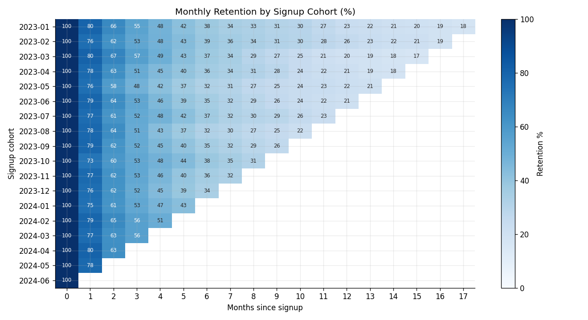
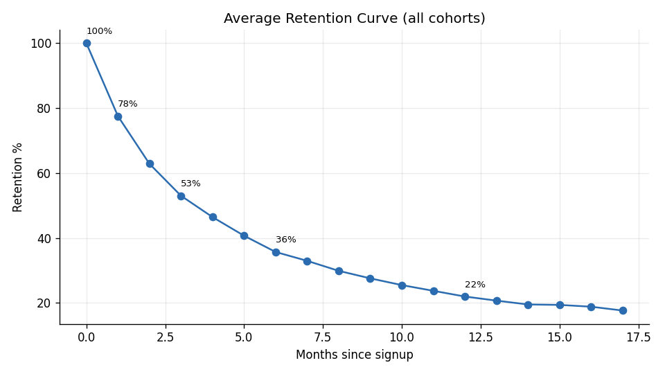

# Cohort Retention & Lifetime Value Analysis

I built a monthly signup cohort retention study across 9,245 customers and 18 acquisition
cohorts, then used it to estimate lifetime value.

Stack: Python, pandas, NumPy, Matplotlib

## The question
How well does the product hold onto customers over time, are newer cohorts doing better than
older ones, and what is a customer actually worth?

## The data
`data/subscription_activity.csv` is a month by month activity log built from 18 signup
cohorts (`cohort_analysis.py`, fixed seed). Each customer gets a persistent loyalty level so
the retention curve flattens out instead of dropping to zero, which is how real subscription
retention behaves. It is synthetic and reproducible, with no proprietary data.

## Run it
```bash
pip install -r requirements.txt
python cohort_analysis.py
```
Charts and a findings summary land in `charts/`.

## What I found
The biggest losses happen early. Retention drops to 77.5% by month 1 and 53.0% by month 3,
then flattens toward a loyal core of roughly 18 to 22% past month 12.

Newer cohorts retain better than older ones. The cohort triangle shows month 3 retention
improving for more recent signups, which suggests the product is getting stickier over time.

ARPU is $27.42 per active customer month. Paired with an average observed lifetime of about
4.5 months, that works out to an average LTV around $123.

Since early churn does most of the damage, onboarding and the first 90 days are where the
real leverage is.

## Charts
| Cohort retention matrix | Average retention curve |
|---|---|
|  |  |

## What I would do next
Put retention spend into months 0 to 3 where the curve is steepest. A few points of month 1
retention compound across the whole curve and pull LTV up with them.
